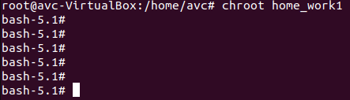

Задание: необходимо продемонстрировать изоляцию одного и того же приложения 
(как решено на семинаре - командного интерпретатора) в различных пространствах имен.

Решение:

Создаем директорию

	root@avc-VirtualBox:/home/avc# mkdir home_work1
	root@avc-VirtualBox:/home/avc# mkdir home_work1/bin

Копируем исполняемый файл bin в каталог home_work1/bin

	root@avc-VirtualBox:/home/avc# cp /bin/bash home_work1/bin

Просматриваем необходимые библиотеки для bin

	root@avc-VirtualBox:/home/avc# ldd /bin/bash

	linux-vdso.so.1 (0x00007ffd97fcc000)

	libtinfo.so.6 => /lib/x86_64-linux-gnu/libtinfo.so.6 (0x00007f23f9417000)

	libc.so.6 => /lib/x86_64-linux-gnu/libc.so.6 (0x00007f23f9000000)
	
	/lib64/ld-linux-x86-64.so.2 (0x00007f23f95bc000)

Создаем каталоги lib и lib64

	root@avc-VirtualBox:/home/avc# mkdir home_work1/lib

	root@avc-VirtualBox:/home/avc# mkdir home_work1/lib64

Копируем библиотеки в home_work1

	root@avc-VirtualBox:/home/avc# cp /lib/x86_64-linux-gnu/libtinfo.so.6 home_work1/lib

	root@avc-VirtualBox:/home/avc# cp /lib/x86_64-linux-gnu/libc.so.6 home_work1/lib

	root@avc-VirtualBox:/home/avc# cp /lib64/ld-linux-x86-64.so.2 home_work1/lib64

Делаем смену корня 

	root@avc-VirtualBox:/home/avc# chroot home_work1 =>

	bash-5.1# 

